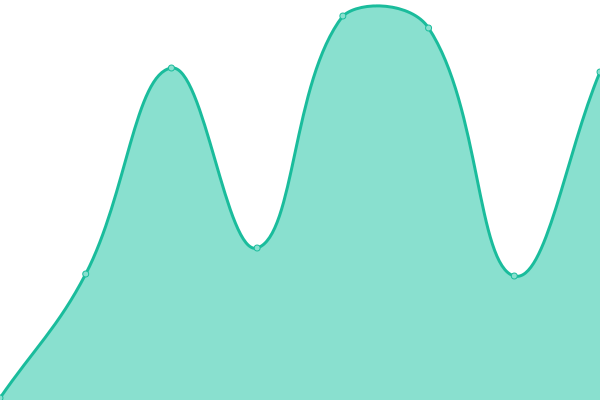

# [📈 Live Status](https://anozimada.github.io/idempiere-status-page): <!--live status--> **🟩 All systems operational**

This repository contains the open-source uptime monitor and status page for [Anozi Mada](www.anozimada.com), powered by [Upptime](https://github.com/upptime/upptime).

With [Upptime](https://upptime.js.org), you can get your own unlimited and free uptime monitor and status page, powered entirely by a GitHub repository. We use [Issues](https://github.com/anozimada/idempiere-status-page/issues) as incident reports, [Actions](https://github.com/anozimada/idempiere-status-page/actions) as uptime monitors, and [Pages](https://anozimada.github.io/idempiere-status-page) for the status page.

<!--start: status pages-->
<!-- This summary is generated by Upptime (https://github.com/upptime/upptime) -->
<!-- Do not edit this manually, your changes will be overwritten -->
<!-- prettier-ignore -->
| URL | Status | History | Response Time | Uptime |
| --- | ------ | ------- | ------------- | ------ |
|  [iDempiere Website](https://www.idempiere.org) | 🟩 Up | [i-dempiere-website.yml](https://github.com/anozimada/idempiere-status-page/commits/HEAD/history/i-dempiere-website.yml) | 

 871ms
     
 | 

<a href="https://anozimada.github.io/idempiere-status-page/history/i-dempiere-website">100.00%</a>
    

|  [iDempiere Wiki](https://wiki.idempiere.org) | 🟩 Up | [i-dempiere-wiki.yml](https://github.com/anozimada/idempiere-status-page/commits/HEAD/history/i-dempiere-wiki.yml) | 

 452ms
     
 | 

<a href="https://anozimada.github.io/idempiere-status-page/history/i-dempiere-wiki">100.00%</a>
    

|  [Demo Stable](https://demo.globalqss.com/webui/) | 🟩 Up | [demo-stable.yml](https://github.com/anozimada/idempiere-status-page/commits/HEAD/history/demo-stable.yml) | 

 604ms
     
 | 

<a href="https://anozimada.github.io/idempiere-status-page/history/demo-stable">100.00%</a>
    

|  [Demo Daily Build with PostgreSQL](https://test.idempiere.org/webui/) | 🟩 Up | [demo-daily-build-with-postgre-sql.yml](https://github.com/anozimada/idempiere-status-page/commits/HEAD/history/demo-daily-build-with-postgre-sql.yml) | 

 204ms
     
 | 

<a href="https://anozimada.github.io/idempiere-status-page/history/demo-daily-build-with-postgre-sql">99.46%</a>
    

|  [Demo Daily Build with Oracle](https://test-oracle.idempiere.org/webui/) | 🟩 Up | [demo-daily-build-with-oracle.yml](https://github.com/anozimada/idempiere-status-page/commits/HEAD/history/demo-daily-build-with-oracle.yml) | 

 573ms
     
 | 

<a href="https://anozimada.github.io/idempiere-status-page/history/demo-daily-build-with-oracle">49.48%</a>
    

|  [Jenkins](https://jenkins.idempiere.org) | 🟩 Up | [jenkins.yml](https://github.com/anozimada/idempiere-status-page/commits/HEAD/history/jenkins.yml) | 

 177ms
     
 | 

<a href="https://anozimada.github.io/idempiere-status-page/history/jenkins">100.00%</a>
    

|  [Mattermost](https://mattermost.idempiere.org) | 🟩 Up | [mattermost.yml](https://github.com/anozimada/idempiere-status-page/commits/HEAD/history/mattermost.yml) | 

 134ms
     
 | 

<a href="https://anozimada.github.io/idempiere-status-page/history/mattermost">100.00%</a>
    

<!--end: status pages-->

[**Visit our status website →**](https://anozimada.github.io/idempiere-status-page)

## 📄 License

- Powered by: [Upptime](https://github.com/upptime/upptime)
- Code: [MIT](./LICENSE) © [Anozi Mada](www.anozimada.com)
- Data in the `./history` directory: [Open Database License](https://opendatacommons.org/licenses/odbl/1-0/)
